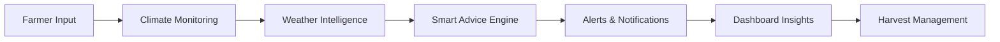

<div align="center">

# 🐛 𝑵𝑨𝑴𝑴𝑨 𝑹𝑬𝑺𝑯𝑴𝑬 🌿

### *Where Tradition Meets Smart Farming*


<br/>


</div>

---

# 🌾 About The Project

**Namma Reshme** is a modern smart sericulture assistant application designed to digitally support silk farmers through real-time climate monitoring, smart notifications, multilingual accessibility, and intelligent batch management.

The application focuses on simplifying traditional silk farming using:

* 🌦️ Real-time climate monitoring
* 📍 GPS-based location intelligence
* 📊 Dynamic batch tracking
* 🔔 Smart farming alerts
* 🌐 Kannada & English support
* ☁️ Cloud-based Firebase integration

---

# ✨ Key Features

<div align="center">

| 🌦️ Climate Monitoring | 🐛 Batch Tracking | 📍 GPS Integration     |
| ---------------------- | ----------------- | ---------------------- |
| Live Temperature       | Harvest Timer     | Current Farm Location  |
| Humidity Tracking      | Batch History     | Auto Address Detection |
| Weather Alerts         | Growth Monitoring | Location-Based Weather |

| 🔔 Smart Alerts   | 🌐 Multilingual   | 🔐 Authentication   |
| ----------------- | ----------------- | ------------------- |
| Harvest Reminders | English Support   | Secure Login        |
| Climate Warnings  | ಕನ್ನಡ Support     | Google Sign-In      |
| Smart Advice      | Runtime Switching | Session Persistence |

</div>

---

# 🧠 System Workflow



---

# ⚡ Technology Stack

```yaml id="lljj4u"
Frontend:
  - Kotlin
  - Jetpack Compose

Backend:
  - Firebase Authentication
  - Firestore Database

APIs & Services:
  - OpenWeather API
  - OpenStreetMap
  - GPS Location Services

Architecture:
  - MVVM
  - Repository Pattern
  - Retrofit
  - WorkManager
```

---

# 📱 UI Highlights

✨ Premium modern Android UI
✨ Responsive mobile layouts
✨ Elegant gradients & animations
✨ Smooth multilingual switching
✨ Farmer-friendly dashboard experience
✨ Clean sericulture-inspired design system

---

# 📊 Project Status

<div align="center">

| Module                  | Status |
| ----------------------- | ------ |
| Firebase Authentication | ✅      |
| Google Sign-In          | ✅      |
| Weather Integration     | ✅      |
| GPS Support             | ✅      |
| Smart Alerts            | ✅      |
| Dynamic Dashboard       | ✅      |
| Kannada Localization    | ✅      |
| Batch Management        | ✅      |

</div>

---

# 🚀 Future Enhancements

* 🤖 AI Disease Detection
* 📡 IoT Sensor Integration
* 📷 Leaf/Image Analysis
* ☁️ Advanced Offline Synchronization
* 📈 Smart Farming Analytics
* 🎙️ Voice Assistance Support

---

<div align="center">

# 🌱 Empowering Farmers Through Smart Technology

### *"Growing Silk with Intelligence & Innovation"*

</div>
